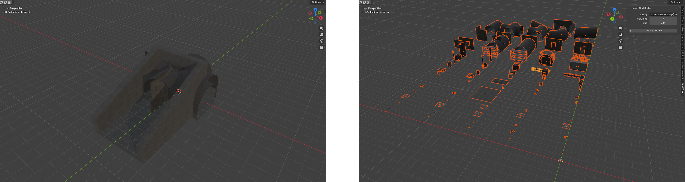
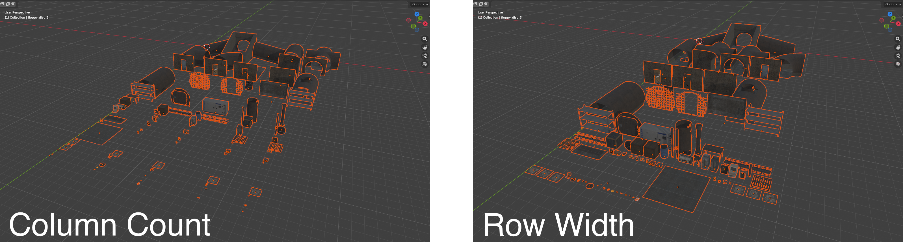

# blender-grid-sorter

I kept buying asset packs and then spending way too long trying to sort the models to find what I wanted, so I made this addon. Compared to other addons, this one will check the size of each object and create a grid where there are no overlaps. As well as this, the objects are only sorted based on the top object, so child objects aren't put into a different part of the grid, keeping everything together.

## What it does

Arranges selected objects into a non-overlapping grid. Settings for the number of columns, the gap between objects, and sort by name or size.

## Sort Options

## Installation

1. Download `grid_sorter.py` from the [latest release](../../releases/latest)
2. In Blender, go to **Edit → Preferences → Add-ons → Install**
3. Select the file and tick the checkbox next to **Smart Grid Sorter**
4. Open the sidebar and select **Grid Tools**
